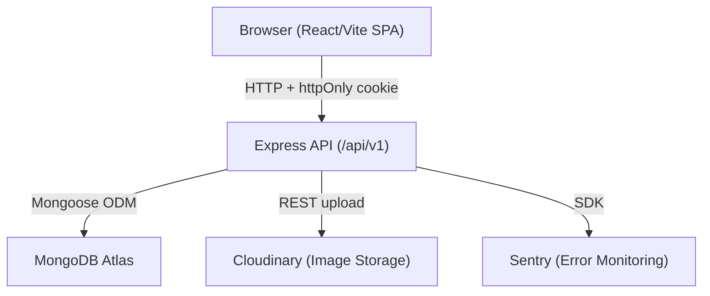

# Design Document: Multi-Vendor E-Commerce Platform

## Overview

A full-stack multi-vendor e-commerce platform built on the MERN stack (MongoDB, Express, React/Vite, Node.js). The platform supports three user roles — superadmin, seller, and buyer — each with distinct capabilities. Sellers register and receive an auto-created store; buyers browse products, manage a persistent cart, place orders, and print invoices. A superadmin oversees the entire platform.

The backend is a REST API served at `/api/v1`, secured with JWT cookies, rate limiting, and standard security middleware. The frontend is a React/Vite SPA with role-based route protection and a single Axios instance for all API communication.

Key design priorities:
- Security: httpOnly JWT cookies, helmet, mongo-sanitize, hpp, strict CORS
- Data integrity: soft deletes, order snapshots, atomic stock deduction
- Maintainability: consistent response format, centralized error handling, Winston logging + Sentry

---

## Architecture



### Backend Layer Structure

```
server/
  app.js              # Express app setup, middleware registration
  server.js           # HTTP server entry point
  config/
    db.js             # Mongoose connection
    cloudinary.js     # Cloudinary SDK config
  middleware/
    auth.js           # Auth_Middleware (JWT verify + user fetch)
    requireStore.js   # RequireStore_Middleware
    restrictTo.js     # Role-based access control
    errorHandler.js   # Global error handler (last middleware)
    rateLimiter.js    # express-rate-limit instances
    validate.js       # express-validator runner
  models/
    User.js
    Store.js
    Supplier.js
    Product.js
    Cart.js
    Order.js
  controllers/
    auth.js
    users.js
    stores.js
    products.js
    suppliers.js
    cart.js
    orders.js
    admin.js
  routes/
    auth.js
    users.js
    stores.js
    products.js
    suppliers.js
    cart.js
    orders.js
    admin.js
  validators/
    auth.js
    products.js
    suppliers.js
    orders.js
  utils/
    logger.js         # Winston logger
    AppError.js       # Custom error class
    cloudinaryHelper.js
```

### Frontend Layer Structure

```
client/
  src/
    main.jsx
    App.jsx
    api/
      axiosInstance.js   # Single Axios instance (withCredentials: true)
    context/
      AuthContext.jsx    # Auth state, populated from /auth/me on load
    components/
      ProtectedRoute.jsx
      Navbar.jsx
      InvoicePrint.jsx
    pages/
      Home.jsx
      About.jsx
      Login.jsx
      Register.jsx
      buyer/
        Cart.jsx
        Orders.jsx
        Invoice.jsx
      seller/
        Dashboard.jsx
        Products.jsx
        Suppliers.jsx
        Orders.jsx
        StoreSettings.jsx
      admin/
        Users.jsx
        Stores.jsx
        Stats.jsx
```

---

## Components and Interfaces

### Middleware Pipeline (request order)

1. `helmet()` — security headers
2. `cors(corsOptions)` — strict origin, credentials
3. `express.json({ limit: '10kb' })` — body parsing + size limit
4. `mongoSanitize()` — strip `$` and `.` from body
5. `hpp()` — prevent parameter pollution
6. Route-specific `rateLimiter` instances
7. Route handlers → controllers
8. `errorHandler` (last)

### Auth Middleware (`middleware/auth.js`)

- Reads JWT from `req.cookies`
- Verifies with `JWT_SECRET`
- Fetches user from DB, checks `isActive: true` and `isDeleted: false`
- Attaches to `req.user`
- Returns 401 on invalid/expired token, 403 on inactive account

### RequireStore Middleware (`middleware/requireStore.js`)

- Checks `req.user.store` is populated
- Attaches `req.storeId = req.user.store`
- Returns 403 if no store found

### restrictTo Middleware (`middleware/restrictTo.js`)

```js
const restrictTo = (...roles) => (req, res, next) => {
  if (!roles.includes(req.user.role)) return next(new AppError('Forbidden', 403));
  next();
};
```

### Rate Limiters (`middleware/rateLimiter.js`)

| Limiter | Window | Max Requests |
|---|---|---|
| `authLimiter` | 15 min | 10 |
| `generalLimiter` | 15 min | 100 |
| `orderLimiter` | 15 min | 20 |
| `uploadLimiter` | 15 min | 10 |

### API Routes Summary

| Method | Path | Auth | Role | Description |
|---|---|---|---|---|
| POST | /auth/register | No | — | Register buyer or seller |
| POST | /auth/login | No | — | Login, set cookie |
| POST | /auth/logout | Yes | any | Expire cookie |
| GET | /auth/me | Yes | any | Get current user |
| GET | /products | No | — | List active products |
| GET | /products/:id | No | — | Get single product |
| POST | /products | Yes | seller | Create product |
| PUT | /products/:id | Yes | seller | Update product |
| DELETE | /products/:id | Yes | seller | Soft-delete product |
| GET | /suppliers | Yes | seller | List store suppliers |
| POST | /suppliers | Yes | seller | Create supplier |
| PUT | /suppliers/:id | Yes | seller | Update supplier |
| DELETE | /suppliers/:id | Yes | seller | Soft-delete supplier |
| GET | /cart | Yes | buyer | Get cart |
| POST | /cart | Yes | buyer | Add item to cart |
| PATCH | /cart/:itemId | Yes | buyer | Update item quantity |
| DELETE | /cart/:itemId | Yes | buyer | Remove item |
| DELETE | /cart | Yes | buyer | Clear cart |
| POST | /orders | Yes | buyer | Place order |
| GET | /orders/my | Yes | buyer | Buyer's orders |
| GET | /orders/store | Yes | seller | Store's orders |
| PATCH | /orders/:id/status | Yes | seller | Update order status |
| GET | /orders/:id/invoice | Yes | buyer/seller/admin | Get invoice data |
| GET | /orders | Yes | superadmin | All orders |
| GET | /stores/me | Yes | seller | Get own store |
| PUT | /stores/me | Yes | seller | Update own store |
| GET | /stores | Yes | superadmin | All stores |
| PATCH | /stores/:id/status | Yes | superadmin | Toggle store active |
| GET | /admin/users | Yes | superadmin | All users |
| PATCH | /admin/users/:id/status | Yes | superadmin | Toggle user active |
| GET | /admin/stats | Yes | superadmin | Platform stats |

### Frontend Components

**AuthContext** — Calls `GET /auth/me` on mount. Provides `user`, `setUser`, `logout`. All protected pages consume this context.

**AxiosInstance** — Single instance with `baseURL: VITE_API_URL`, `withCredentials: true`. Interceptor on 401 response: clear AuthContext, redirect to `/login`.

**ProtectedRoute** — Wraps React Router routes. Checks `user` from AuthContext; redirects to `/login` if unauthenticated. Accepts `allowedRoles` prop; redirects to role dashboard if role mismatch.

**InvoicePrint / Invoice page** — Renders exclusively from snapshot fields. Calls `useEffect` with `setTimeout(window.print, 500)` after data loads. Uses `@media print` CSS to hide nav/buttons.

---

## Data Models

### User

```js
{
  name: { type: String, required, minlength: 2, maxlength: 50, trim: true },
  email: { type: String, required, unique, lowercase, trim: true },
  phone: { type: String, required, trim: true },
  password: { type: String, required, minlength: 8, select: false },
  role: { type: String, enum: ['buyer', 'seller', 'superadmin'], required },
  store: { type: ObjectId, ref: 'Store', default: null },
  isActive: { type: Boolean, default: true },
  isDeleted: { type: Boolean, default: false },
  deletedAt: { type: Date, default: null },
  // Indexes: email (unique)
}
```

### Store

```js
{
  name: { type: String, required, trim: true },
  slug: { type: String, unique },           // auto-generated pre-save
  owner: { type: ObjectId, ref: 'User', required },
  logo: { type: String, default: null },    // Cloudinary URL
  address: { type: String, trim: true },
  phone: { type: String, trim: true },
  email: { type: String, trim: true },
  invoiceNote: { type: String, trim: true },
  isActive: { type: Boolean, default: true },
  isDeleted: { type: Boolean, default: false },
  deletedAt: { type: Date, default: null },
  // Indexes: slug (unique)
}
```

### Supplier

```js
{
  name: { type: String, required, trim: true },
  email: { type: String, trim: true },
  phone: { type: String, trim: true },
  address: { type: String, trim: true },
  store: { type: ObjectId, ref: 'Store', required },
  isDeleted: { type: Boolean, default: false },
  deletedAt: { type: Date, default: null },
  // Indexes: store
}
```

### Product

```js
{
  name: { type: String, required, minlength: 2, maxlength: 100, trim: true },
  slug: { type: String },                   // auto-generated pre-save
  description: { type: String, trim: true },
  price: { type: Number, required, min: 0 },
  stock: { type: Number, required, min: 0, integer: true },
  category: { type: String, required, trim: true },
  unit: { type: String, trim: true },
  images: [{ type: String }],               // Cloudinary URLs
  store: { type: ObjectId, ref: 'Store', required },
  supplier: { type: ObjectId, ref: 'Supplier', default: null },
  isActive: { type: Boolean, default: true },
  isDeleted: { type: Boolean, default: false },
  deletedAt: { type: Date, default: null },
  // Indexes: { store, isActive, isDeleted }, { category }
}
```

### Cart

```js
{
  buyer: { type: ObjectId, ref: 'User', required, unique },
  store: { type: ObjectId, ref: 'Store', default: null },
  items: [{
    product: { type: ObjectId, ref: 'Product', required },
    name: String,
    price: Number,
    quantity: { type: Number, min: 1 },
    subtotal: Number,
  }],
  totalAmount: { type: Number, default: 0 },  // auto-calculated pre-save
  isDeleted: { type: Boolean, default: false },
  deletedAt: { type: Date, default: null },
  // Indexes: buyer (unique)
}
```

### Order

```js
{
  orderNumber: { type: String, unique },    // ORD-YYYYMMDD-XXXX, pre-save
  buyer: { type: ObjectId, ref: 'User', required },
  store: { type: ObjectId, ref: 'Store', required },
  buyerSnapshot: {
    name: String, phone: String, email: String, address: String,
  },
  storeSnapshot: {
    name: String, phone: String, email: String,
    address: String, logo: String, invoiceNote: String,
  },
  items: [{
    name: String, price: Number, quantity: Number,
    unit: String, subtotal: Number,
  }],
  totalAmount: Number,
  discountAmount: { type: Number, default: 0 },
  taxAmount: { type: Number, default: 0 },
  grandTotal: Number,
  status: {
    type: String,
    enum: ['pending', 'confirmed', 'processing', 'completed', 'cancelled'],
    default: 'pending',
  },
  paymentStatus: { type: String, enum: ['unpaid', 'paid'], default: 'unpaid' },
  notes: { type: String, trim: true },
  isDeleted: { type: Boolean, default: false },
  deletedAt: { type: Date, default: null },
  // Indexes: { buyer, createdAt }, { store, createdAt }, { orderNumber }
}
```

### Pre-save Hooks Summary

| Model | Hook | Action |
|---|---|---|
| Store | pre-save | Generate `slug` from `name` (slugify) |
| Product | pre-save | Generate `slug` from `name` (slugify) |
| Cart | pre-save | Recalculate `totalAmount` from items |
| Order | pre-save | Generate `orderNumber` as `ORD-YYYYMMDD-XXXX` |


---

## Correctness Properties

*A property is a characteristic or behavior that should hold true across all valid executions of a system — essentially, a formal statement about what the system should do. Properties serve as the bridge between human-readable specifications and machine-verifiable correctness guarantees.*

### Property 1: Password never appears in responses

*For any* API endpoint that returns user data, the response body SHALL NOT contain a `password` field, regardless of how the user was queried or which role made the request.

**Validates: Requirements 1.8, 2.8**

---

### Property 2: Seller registration creates a linked store

*For any* valid registration request with `role: "seller"`, the resulting User document SHALL have a non-null `store` field pointing to a newly created Store document whose `owner` matches the new user's ID.

**Validates: Requirements 1.3**

---

### Property 3: Duplicate email is rejected

*For any* two registration requests sharing the same email address, the second request SHALL return HTTP 409 and no additional User document SHALL be created.

**Validates: Requirements 1.4**

---

### Property 4: Input sanitization strips whitespace and HTML

*For any* registration or update request containing string fields with leading/trailing whitespace or HTML special characters, the persisted document SHALL contain the trimmed and escaped version of those strings.

**Validates: Requirements 1.5**

---

### Property 5: Passwords are stored as bcrypt hashes

*For any* registered user, the `password` field stored in MongoDB SHALL be a valid bcrypt hash (starting with `$2b$`) and SHALL NOT equal the plaintext password submitted during registration.

**Validates: Requirements 1.7**

---

### Property 6: Login sets a secure httpOnly cookie

*For any* successful login request, the response SHALL set a cookie that is `httpOnly`, `Secure`, `SameSite=Strict`, has a 7-day expiry, and the JWT SHALL NOT appear in the response body.

**Validates: Requirements 2.1, 2.2**

---

### Property 7: Role-based access control returns 403 for unauthorized roles

*For any* route protected by `restrictTo(...roles)`, any authenticated request from a user whose role is not in the permitted list SHALL receive HTTP 403, regardless of the specific route or resource.

**Validates: Requirements 3.1, 3.4, 3.5**

---

### Property 8: Store ownership enforced on all seller resource operations

*For any* seller operation (read, create, update, delete) on a resource that has a `store` field, if that field does not match `req.storeId`, the API SHALL return HTTP 403 and the operation SHALL NOT be applied.

**Validates: Requirements 3.2, 7.2, 7.3, 8.2, 11.2**

---

### Property 9: Soft delete sets isDeleted and deletedAt

*For any* delete operation on any model (User, Store, Supplier, Product, Cart, Order), the resulting document SHALL have `isDeleted: true` and `deletedAt` set to a non-null timestamp, and the document SHALL still exist in the database.

**Validates: Requirements 6.3**

---

### Property 10: Soft-deleted records are excluded from queries

*For any* query on any model, documents where `isDeleted: true` SHALL NOT appear in the results unless the query explicitly overrides this filter.

**Validates: Requirements 6.2**

---

### Property 11: Slug auto-generation for Store and Product

*For any* Store or Product document saved with a `name` field, the resulting document SHALL have a `slug` field that is a URL-safe, lowercase, hyphenated representation of the name.

**Validates: Requirements 6.5, 6.6**

---

### Property 12: Order number matches required format

*For any* newly created Order document, the `orderNumber` field SHALL match the pattern `ORD-YYYYMMDD-XXXX` where `YYYYMMDD` is the creation date and `XXXX` is a sequential or unique suffix.

**Validates: Requirements 6.7**

---

### Property 13: Cart enforces single-store constraint

*For any* buyer's cart that already contains items from store A, attempting to add an item from any other store B SHALL return HTTP 409 and the cart SHALL remain unchanged.

**Validates: Requirements 9.2**

---

### Property 14: Cart price re-validation on fetch

*For any* cart fetch where one or more product prices have changed since the item was added, the returned cart SHALL reflect the current prices from the Product collection, and `totalAmount` SHALL be recalculated accordingly.

**Validates: Requirements 9.3**

---

### Property 15: Cart totalAmount is always the sum of item subtotals

*For any* cart document with any number of items, `totalAmount` SHALL equal the sum of `price × quantity` for all items in the `items` array, as enforced by the pre-save hook.

**Validates: Requirements 9.4**

---

### Property 16: Order placement validates stock for all items

*For any* order placement request where at least one cart item's requested quantity exceeds the product's current `stock`, the API SHALL return HTTP 409 and no Order document SHALL be created.

**Validates: Requirements 10.1**

---

### Property 17: Order snapshots capture complete buyer, store, and item data

*For any* successfully created Order, the `buyerSnapshot` SHALL contain the buyer's name, phone, email, and address; the `storeSnapshot` SHALL contain the store's name, phone, email, address, logo, and invoiceNote; each entry in `items` SHALL contain name, price, quantity, unit, and subtotal; and `status` SHALL be `pending` with `paymentStatus` as `unpaid`.

**Validates: Requirements 10.2, 10.3, 10.4, 10.7**

---

### Property 18: Order creation atomically deducts stock and clears cart

*For any* successfully placed order, each product's `stock` SHALL be reduced by the ordered quantity, and the buyer's Cart document SHALL have an empty `items` array and `totalAmount` of 0.

**Validates: Requirements 10.5**

---

### Property 19: Order listings are scoped to the requesting party

*For any* seller calling `GET /orders/store`, only orders where `store` matches `req.storeId` SHALL be returned. *For any* buyer calling `GET /orders/my`, only orders where `buyer` matches the authenticated user's ID SHALL be returned. *For any* superadmin calling `GET /orders`, all non-deleted orders SHALL be returned.

**Validates: Requirements 11.1, 11.4, 11.5**

---

### Property 20: Order status transitions are restricted to valid enum values

*For any* order status update request, only values in `['pending', 'confirmed', 'processing', 'completed', 'cancelled']` SHALL be accepted; any other value SHALL result in a validation error.

**Validates: Requirements 11.3**

---

### Property 21: API responses follow a consistent format

*For any* successful API response, the body SHALL match `{ "status": "success", "data": {}, "message": "..." }`. *For any* error API response, the body SHALL match `{ "status": "error", "message": "...", "errors": [] }`.

**Validates: Requirements 17.1, 17.2, 17.3**

---

### Property 22: ProtectedRoute enforces authentication and role access

*For any* unauthenticated user accessing a protected route, they SHALL be redirected to `/login`. *For any* authenticated user accessing a route restricted to a different role, they SHALL be redirected to their own role's dashboard.

**Validates: Requirements 19.1, 19.2**

---

### Property 23: Product search and category filter return only matching results

*For any* search query, all returned products SHALL contain the search term in their name. *For any* category filter, all returned products SHALL belong to that category. In both cases, only products with `isActive: true` and `isDeleted: false` SHALL appear.

**Validates: Requirements 7.6, 20.2, 20.3**

---

### Property 24: Image uploads reject invalid MIME types

*For any* image upload request with a MIME type other than `image/jpeg`, `image/png`, or `image/webp`, the API SHALL return HTTP 422 and no image SHALL be stored.

**Validates: Requirements 13.1**

---

### Property 25: Only Cloudinary URL strings are stored for images

*For any* product or store document with images, the stored value SHALL be a URL string (not binary data), and the URL SHALL match the expected Cloudinary path pattern for that resource type.

**Validates: Requirements 13.3, 13.4**

---

## Error Handling

### AppError Class

A custom `AppError` extends `Error` with `statusCode` and `isOperational` fields. All controllers throw `AppError` instances for expected failures (404, 403, 409, etc.).

```js
class AppError extends Error {
  constructor(message, statusCode) {
    super(message);
    this.statusCode = statusCode;
    this.isOperational = true;
  }
}
```

### Global Error Handler

Registered last in `app.js`. Handles:

| Error Type | Response |
|---|---|
| `AppError` (operational) | `statusCode` from error, `{ status: "error", message }` |
| Mongoose `ValidationError` | HTTP 422, field-level errors |
| Mongoose `CastError` | HTTP 400, "Invalid ID" |
| MongoDB duplicate key (code 11000) | HTTP 409, descriptive message |
| JWT `JsonWebTokenError` | HTTP 401 |
| JWT `TokenExpiredError` | HTTP 401 |
| Unhandled (non-operational) | HTTP 500, generic message (no stack trace in production) |

Stack traces are never included in production responses (`NODE_ENV === 'production'`).

### Client-Side Error Handling

- Axios interceptor catches HTTP 401 globally → clears AuthContext → redirects to `/login`
- All API calls wrapped in try/catch; errors displayed via toast notifications
- Form validation errors (422) displayed inline per field

---

## Testing Strategy

### Dual Testing Approach

Both unit tests and property-based tests are required. They are complementary:
- Unit tests catch concrete bugs with specific inputs and edge cases
- Property-based tests verify general correctness across many generated inputs

### Unit Tests

Focus areas:
- Specific examples: successful registration, login, order placement
- Edge cases: duplicate email, superadmin role rejection, zero-quantity cart item removal, out-of-stock order
- Integration points: middleware chain (auth → requireStore → restrictTo → controller)
- Error conditions: invalid JWT, inactive user, wrong store ownership

Framework: **Jest** (backend), **Vitest + React Testing Library** (frontend)

### Property-Based Tests

Framework: **fast-check** (JavaScript/TypeScript property-based testing library)

Each property test runs a minimum of **100 iterations**.

Each test is tagged with a comment in the format:
`// Feature: multi-vendor-ecommerce, Property N: <property_text>`

| Property | Test Description | Generator Inputs |
|---|---|---|
| P1 | Password never in response | Random valid user data |
| P2 | Seller registration creates store | Random seller registration data |
| P3 | Duplicate email rejected | Random email, register twice |
| P4 | Input sanitization | Strings with whitespace/HTML chars |
| P5 | Bcrypt hash stored | Random passwords |
| P6 | Login sets httpOnly cookie | Random valid credentials |
| P7 | restrictTo returns 403 | Random roles vs allowed role lists |
| P8 | Store ownership enforced | Random seller + resource with different storeId |
| P9 | Soft delete sets fields | Random documents of each model type |
| P10 | Soft-deleted excluded from queries | Random mix of deleted/active records |
| P11 | Slug auto-generation | Random store/product names |
| P12 | Order number format | Random order creation timestamps |
| P13 | Cart single-store constraint | Random products from different stores |
| P14 | Cart price re-validation | Random price changes |
| P15 | Cart totalAmount invariant | Random cart items with price/quantity |
| P16 | Stock validation on order | Random cart items with varying stock levels |
| P17 | Order snapshot completeness | Random buyer/store/product data |
| P18 | Stock deduction and cart clear | Random valid orders |
| P19 | Order listing scoped | Random orders across multiple buyers/stores |
| P20 | Valid order status transitions | Random status strings |
| P21 | API response format | Random successful and error responses |
| P22 | ProtectedRoute access control | Random user roles vs route requirements |
| P23 | Product search/filter | Random product sets and search terms |
| P24 | Image MIME type validation | Random MIME type strings |
| P25 | Cloudinary URL storage | Random image uploads |

### Test Configuration Example

```js
// Feature: multi-vendor-ecommerce, Property 15: Cart totalAmount is always the sum of item subtotals
test('cart totalAmount equals sum of price*quantity', () => {
  fc.assert(
    fc.property(
      fc.array(fc.record({
        price: fc.float({ min: 0, max: 10000 }),
        quantity: fc.integer({ min: 1, max: 100 }),
      }), { minLength: 1 }),
      (items) => {
        const cart = new Cart({ items });
        // pre-save hook calculates totalAmount
        const expected = items.reduce((sum, i) => sum + i.price * i.quantity, 0);
        expect(cart.totalAmount).toBeCloseTo(expected);
      }
    ),
    { numRuns: 100 }
  );
});
```

### Test Coverage Targets

- Backend controllers: 80%+ line coverage
- Middleware: 100% branch coverage (auth, restrictTo, requireStore, errorHandler)
- Data models: 100% pre-save hook coverage
- Frontend: critical paths (auth flow, cart, order placement, invoice render)
